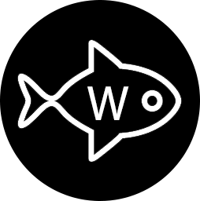

# 🐟 Nemoword-Backend-Nestjs




A secure password manager API built with [NestJS](https://nestjs.com/), Prisma, and MySQL.  
Safely store, manage, and share passwords with others. 🛡️🔑

---

## 🚀 Overview

Nemoword-Backend-Nestjs is a RESTful API for managing users and their passwords ("fishes").  
It features robust authentication, password hashing, encryption, and user-friendly error handling.

- **Tech Stack:** NestJS, Prisma, MySQL, JWT, bcrypt
- **Security:** Passwords are hashed and sensitive data is encrypted
- **Features:** User registration, login, password CRUD, JWT authentication

---

## 📦 Features

- User registration & login (JWT-based)
- Password (fish) management: create, read, update, delete
- Secure password hashing & encryption
- Global error handling
- Modular, scalable codebase

---

## 📚 API Endpoints

### Auth

| Method | Endpoint         | Description                | 
|--------|------------------|----------------------------|
| POST   | `/auth/signup`   | Register a new user        | 
| POST   | `/auth/login`    | Login and get JWT token    | 
| GET    | `/auth/myprofile`| Get current user profile   | 

### User

| Method | Endpoint         | Description                | 
|--------|------------------|----------------------------|
| POST   | `/user`          | Create a new user          |
| GET    | `/user`          | List all users             | 
| GET    | `/user/:id`      | Get user by ID             |
| PATCH  | `/user/:id`      | Update user by ID          |
| DELETE | `/user/:id`      | Delete user by ID          |

### Fish (Password)

| Method | Endpoint                   | Description                        |
|--------|----------------------------|------------------------------------|
| POST   | `/fish`                    | Create a new password (fish)       |
| GET    | `/fish`                    | List all passwords (fishes)        |
| GET    | `/fish/SpecificUser`       | List passwords for current user    |
| GET    | `/fish/:id`                | Get password by ID (current user)  |
| PUT    | `/fish/:id`                | Update password by ID              |
| DELETE | `/fish/:id`                | Delete password by ID              | 

---

## 🛠️ Getting Started

1. **Clone the repo**
   ```sh
   git clone https://github.com/yourusername/Nemoword-Backend-Nestjs.git
   cd Nemoword-Backend-Nestjs
   ```

2. **Install dependencies**
   ```sh
   npm install
   ```

3. **Configure environment**
   - Edit `.env` and `config.env` for your DB and JWT secrets.

4. **Run migrations**
   ```sh
   npx prisma migrate deploy
   ```

5. **Start the server**
   ```sh
   npm run start:dev
   ```

---

## 🔒 Security

- Passwords are hashed with bcrypt before storage.
- Sensitive fields (like password/email in Fish) are encrypted.
- JWT authentication protects sensitive endpoints.

---

## 📖 Example Usage

**Register:**
```http
POST /auth/signup
{
  "username": "alice",
  "email": "alice@example.com",
  "password": "yourpassword",
  "ConfirmPassword": "yourpassword"
}
```

**Login:**
```http
POST /auth/login
{
  "email": "alice@example.com",
  "password": "yourpassword"
}
```

**Create a Fish (password):**
```http
POST /fish
Authorization: Bearer <JWT_TOKEN>
{
  "email": "service@example.com",
  "password": "servicepassword"
}
```


> Made with ❤️ using NestJS & Prisma